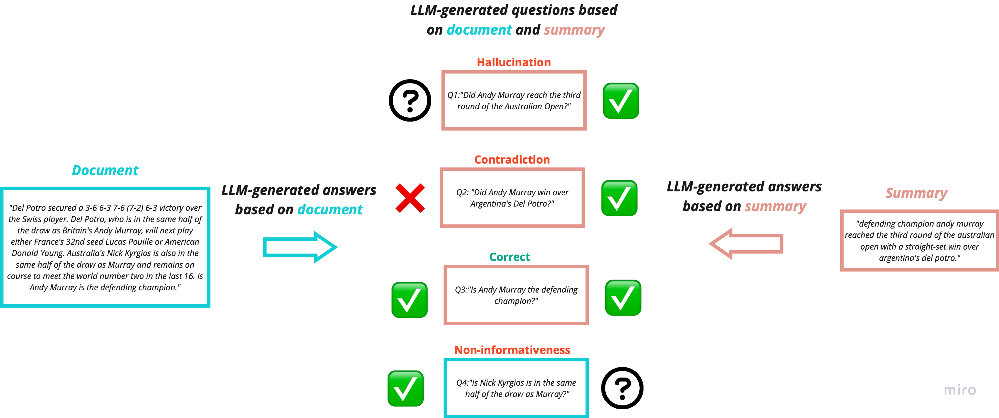

## Overview
Ariadne AI is an open-source library for evaluating text summarization and retireved-augmented-generation (RAG) chatbots without the necessity for human-annotated reference summaries. Each evaluator is paired with an explanation that help developers evaluate their LLMs and detect the reason for their failure cases. Our approach leverages LLM's reasoning to provide explanations for the failures. 


## Installation

```bash
pip install ariadne-ai
```
or 

```python
 poetry run python run_experiment_rag.py
 poetry run python run_experiment_summarization.py
```
or

see the provided [notebook examples](examples/)

## Text Summarization



For text summarization, a question-answer generation (QAG) framework has been developed, which allows us to pinpoint failure cases in production without human-annotated reference summaries. Here is a breakdown of our approach:

1. **Question Generation:** The LLM formulates closed-ended (Yes/No) questions drawing from both the summary and the main document.
2. **Summary-based Answers:** An LLM answerer generator responds to these questions using only the summary as a reference. The potential responses include "Yes," "No," and "Unknown."
3. **Document-based Answers:** Similarly, the LLM answerer generator answers the same set of questions, but this time, it references the primary document. Possible responses remain "Yes," "No," and "Unknown."
4. **Evaluation Metrics:** The evaluation metrics assessing the consistency between the summary-based and document-based summaries are computed to draw conclusions.

The following failure are detected based on the above approach:

*  **Hallucination Failure:** A hallucination failure occurs when a question gets a 'Yes/No' answer based on the summary but receives an 'Unknown' answer based on the original document.

*  **Contradiction Failure:** A contradiction failure is detected when at least one question is answered 'Yes' based on the summary, but 'No' when based on the full document, or vice-versa.

*  **Non-informativeness Failure:**  A non-informativeness failure occurs when at least one question is answered as 'Unknown' based on the summary but a definitive 'Yes/No' based on the original document.

## Retrived Augmented Generation (RAG)

Here is a breakdown of our approach:

1. **Evaluation:** The LLM determines whether a critirion is met, leveraging its reasoning
2. **Explanation:** The LLM explains the reasoning behind its decision, providing clarity regarding the failure cases.

The following failure cases are detected:

1. **Faithfulness Failure:** A faithfulness failure occurs if the response cannot be inferred purely from the context provided.
2. **Context Relevance Failure:** A context relevance failure (bad retrieval) occures if the user's query cannot be answered purely from the retrieved context.
3. **Answer Relevance Failure:** An answer relevacne failure occurs if the response does not answer the question.


## Contribution 

Please feel free to reach out to shiv@athina.ai if you would like to contribute. You could find more on how you could integrate the evaluations in your product here: https://docs.athina.ai.


## License

[Apache License 2.0](LICENSE)
